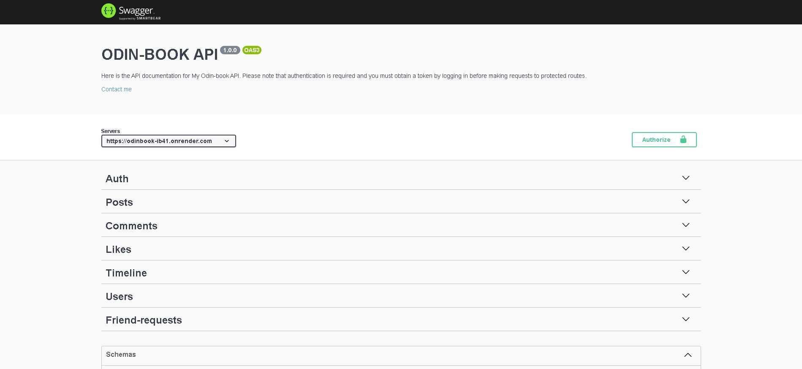

# odin-book-api
This project is the part of [nodejs](https://www.theodinproject.com/lessons/nodejs-blog-api) course on the odin projects full stack javascript cirriculum.
This project uses [SwaggerUI](https://swagger.io/) for API Documentation.

## Screenshot



  
## Demo

🔑 Token : Don't forget to log in and take your token to send request to protected routes

👉 See it live [here](https://odinbook-l98j.onrender.com)

  
## Features

- `User Authentication:` Users can create an account, securely login/logout, and access protected routes using a token-based authentication system.

- `Post Management:` Authorized users can create new posts, update existing posts, and delete posts that they have created.

- `Comment Management:` Authorized users can create new comments on posts, update existing comments, and delete comments that they have created.

- `Post Interaction:` Users can like/unlike posts and comments, as well as comment on posts.

- `Friend System:` Users can send and receive friend requests, view their list of friends, and see friend recommendations on their timeline.

- `Timeline:` Each user has their own timeline, which displays their posts as well as their friends' posts and unique friend recommendations.

- `Admin Management:` Admins can manage user accounts, and delete inappropriate posts or comments.


  
## Run project locally

Clone the project

```bash
  git clone https://github.com/mustafa-mun/odin-book-api
```

Go to the project directory

```bash
  cd odin-book-api
```

Install the required packages

```bash
  npm install
```

Start the server

```bash
  npm  start
```
